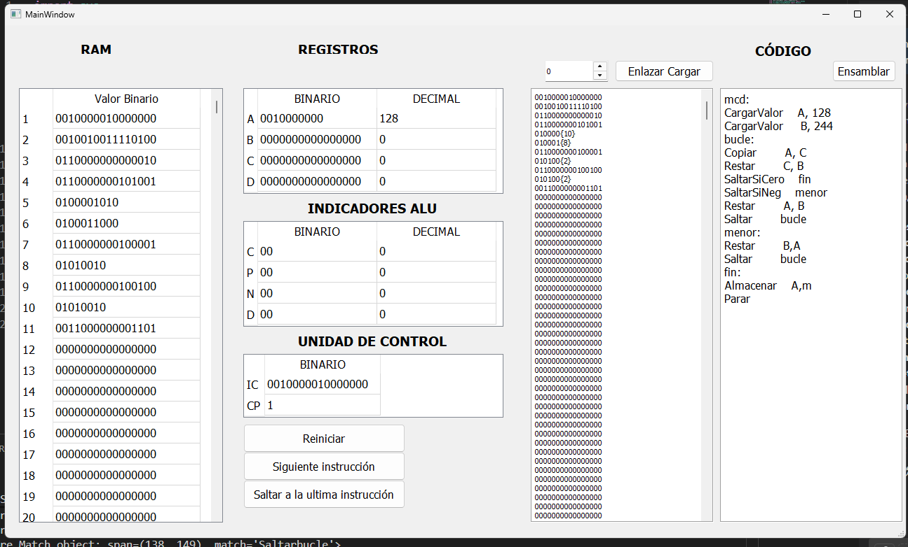
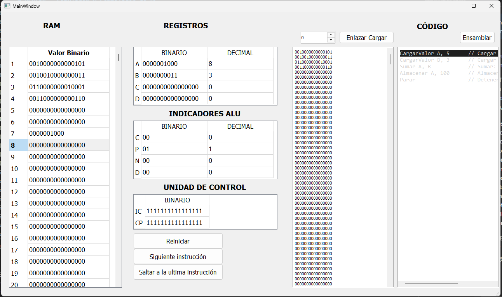

# PCPENA - Simulador y Compilador de PC

Un simulador educativo de PC Turing-completo con compilador integrado de lenguaje de alto nivel, inspirado en el libro de texto **"De Euclides a Java"**. Este proyecto demuestra la cadena completa de compilación: desde lenguaje de alto nivel → análisis léxico → ensamblador → código binario → ejecución de instrucciones paso a paso con visualización de registros en tiempo real.

## 📚 Descripción General

**Desarrollado para la Universidad Nacional de Colombia**

**PCPENA** (Simulador PC Simplificado) es una herramienta educativa interactiva que permite a los estudiantes:
- Escribir y compilar programas en lenguaje de alto nivel
- Observar el proceso de análisis léxico y tokenización usando PLY (Python Lex-Yacc)
- Ver la generación de código ensamblador con resolución de etiquetas y reubicación de variables
- Ejecutar instrucciones binarias en una máquina virtual
- Visualizar el estado de la CPU en cada instrucción: registros, RAM, banderas ALU y unidad de control
- Comprender el ciclo completo de compilación y ejecución

## 🏗️ Arquitectura

### Cadena de Procesamiento

```
Código de Alto Nivel → Lexer (PLY) → Parser → Ensamblador → Enlazador/Cargador → Máquina Virtual
```

### Componentes Principales

#### 1. **Lexer** (`src/models/Lexer.py`)
- Utiliza PLY (Python Lex-Yacc) para tokenización
- Soporta sintaxis personalizada de lenguaje de alto nivel
- Los tokens incluyen: números, operadores, palabras clave, variables, funciones, estructuras de control
- Mantiene tabla de símbolos para búsqueda de variables

#### 2. **Ensamblador** (`src/models/Assembler.py`)
- Compilación ensambladora en dos pasadas
- **Pasada 1:** Resolución de etiquetas y asignación de variables
- **Pasada 2:** Conversión de códigos de operación a código máquina binario
- Maneja la reubicación de direcciones de memoria
- Soporta 14 tipos de instrucciones

#### 3. **Enlazador/Cargador** (`src/models/LinkerLoader.py`)
- Realiza resolución de símbolos
- Carga el código binario en memoria virtual
- Traslada direcciones de memoria según el punto de inicio del programa
- Inicializa el contador de programa y punteros de instrucción

#### 4. **Máquina Virtual** (`src/models/VirtualMachine.py`)
- **4 Registros de Propósito General:** A, B, C, D (16 bits cada uno)
- **1024 Palabras de RAM** (celdas direccionables de 16 bits)
- **Banderas ALU:** Cero (C), Positivo (P), Negativo (N), Desbordamiento (D)
- **Unidad de Control:** Gestiona el puntero de instrucción y estado de ejecución

#### 5. **GUI** (`src/views/pcDesigntaller.py`)
- Interfaz gráfica basada en PyQt5
- Visualización en tiempo real de: RAM, registros, banderas ALU, unidad de control, código objeto
- Botones interactivos: Siguiente, Último, Reiniciar, Ensamblar, Enlazar/Cargar

#### 6. **Controlador** (`src/controllers/windowController.py`)
- Conecta el modelo de máquina con la vista PyQt5
- Actualiza el estado de la GUI después de cada operación de máquina

## 🖥️ Arquitectura de la Máquina Virtual

### Registros (4 × 16 bits)
| Registro | Código |
|----------|--------|
| A        | 00     |
| B        | 01     |
| C        | 10     |
| D        | 11     |

### Conjunto de Instrucciones (14 Instrucciones)

| Instrucción      | Código de Operación | Descripción                          |
|------------------|---------------------|--------------------------------------|
| Parar            | 0000000000000000 | Detener ejecución                    |
| Cargar           | 0001        | Cargar desde memoria a registro      |
| CargarValor      | 0010        | Cargar valor inmediato a registro    |
| Almacenar        | 0011        | Almacenar registro en memoria        |
| SaltarSiCero     | 010000      | Saltar si bandera cero activa        |
| SaltarSiNeg      | 010001      | Saltar si bandera negativa activa    |
| SaltarSiPos      | 010010      | Saltar si bandera positiva activa    |
| SaltarSiDes      | 010011      | Saltar si bandera desbordamiento activa |
| Saltar           | 010100      | Salto incondicional                  |
| Copiar           | 011000000000 | Copiar registro a registro           |
| Sumar            | 011000000001 | Sumar (resultado en primer registro) |
| Restar           | 011000000010 | Restar (resultado en primer registro) |
| Mult             | 011000000011 | Multiplicar (resultado en primer registro) |
| Div              | 011000000100 | División entera (resultado en primero) |

## 🚀 Inicio Rápido

### Linux (Debian/Ubuntu)

```bash
# Instalar dependencias del sistema
sudo apt install python3-tk python3-dev

# Crear entorno virtual
python3 -m venv emuenv
source emuenv/bin/activate

# Instalar dependencias de Python
pip install -r requirements.txt

# Ejecutar el simulador
python maintaller.py
```

### Windows

```bash
# Crear entorno virtual
python -m venv emuenv
emuenv\Scripts\activate

# Instalar dependencias de Python
pip install -r requirements.txt

# Ejecutar el simulador
python maintaller.py
```

### Opcional: Herramientas de Diseño GUI (Linux)

```bash
sudo apt install pyqt5-dev-tools qttools5-dev-tools
```

## 📦 Dependencias

- **PyQt5**: Marco de trabajo para interfaz gráfica
- **ply**: Python Lex-Yacc para análisis léxico
- **Python 3.7+**

## 🎯 Uso

1. **Escriba Código Ensamblador** en el editor de código
2. Haga clic en **"Ensamblar"** para compilar a binario
3. **Enlace y Cargue** en la dirección de memoria deseada
4. **Ejecute Instrucciones** paso a paso
5. **Monitoree el Estado**: Registros, RAM, banderas ALU, unidad de control

### Programa de Ejemplo

```assembly
CargarValor A, 5      // Cargar 5 en registro A
CargarValor B, 3      // Cargar 3 en registro B
Sumar A, B            // Sumar: A = A + B (8)
Almacenar A, 100      // Almacenar en dirección 100
Parar                 // Detener
```

## 📸 Capturas de Pantalla

Aquí hay algunos ejemplos del simulador en acción:




## 🎥 Ejemplo en Video

Vea una demostración completa de PCPENA en acción:

[](https://youtu.be/RNxGJ1oT91E)


## 📋 Sintaxis del Lenguaje de Alto Nivel

El compilador soporta un lenguaje de alto nivel personalizado con las siguientes palabras clave:

```
fun <nombre>(<parámetros>) ... ffun       // Definición de función
var <var1>, <var2>, ...                   // Declaración de variables
mientras <condición> ... fmientras        // Bucle while
caso <valor> ... hacer                    // Sentencia switch/case
dev <valor>                               // Sentencia return
```

### Operadores
- Aritméticos: `+`, `-`, `*`, `/`, `mod`
- Relacionales: `<`, `>`, `<=`, `>=`, `=`
- Agrupación lógica: `(`, `)`
- Delimitadores: `,`, `;`, `:`

## 🔧 Detalles Técnicos

### Ciclo de Ejecución de Instrucciones

1. **Búsqueda (Fetch)**: Leer instrucción desde `table_ram[instruccion_actual]`
2. **Decodificación (Decode)**: Emparejar código de operación con tipo de instrucción
3. **Ejecución (Execute)**:
   - Cargar valores de operandos (registros o memoria)
   - Realizar operación
   - Actualizar registro de destino
   - Actualizar banderas ALU si es operación aritmética
4. **Actualización de Control**: Actualizar punteros de instrucción y estado de unidad de control

### Representación de Datos

- **Enteros**: Complemento a dos de 16 bits (rango: -32,768 a 32,767)
- **Formato Binario**: Rellenado a 16 bits con ceros a la izquierda
- **Direccionamiento de Memoria**: Direcciones de 10 bits (soporta 1024 celdas)

### Compilación Ensambladora en Dos Pasadas

**Pasada 1 (Resolución de Etiquetas/Variables):**
- Escanear todas las declaraciones
- Registrar direcciones de etiquetas para destinos de saltos
- Asignar memoria para variables
- Construir tablas de símbolos

**Pasada 2 (Generación de Código):**
- Generar códigos de operación binarios para cada instrucción
- Reemplazar referencias de etiquetas con direcciones de memoria
- Resolver reubicaciones de variables
- Generar código objeto binario

## 📚 Valor Educativo

Este proyecto enseña:
- **Diseño de Compiladores**: Análisis léxico, generación de código
- **Arquitectura de Computadoras**: Registros, memoria, operaciones ALU
- **Turing Completitud**: Instrucciones de salto y aritmética
- **Programación a Nivel de Máquina**: Interacción directa con CPU

### Conceptos de Compilador

- **Tokenización**: Dividir el código fuente en símbolos significativos
- **Análisis de Sintaxis**: Reconocer la estructura del lenguaje
- **Generación de Código**: Producir instrucciones de máquina
- **Gestión de Símbolos**: Rastrear ubicaciones de variables/etiquetas

### Conceptos de Arquitectura de Computadoras

- **Operaciones de Registro**: Almacenamiento y manipulación directa de CPU
- **Gestión de Memoria**: Organización de RAM y direccionamiento
- **Flujo de Control**: Instrucciones de salto y banderas de condición
- **Operaciones ALU**: Aritmética y lógica con actualizaciones de estado


## 🎓 Obra de Referencia

Inspirado en el libro de texto **"De Euclides a Java"** 
